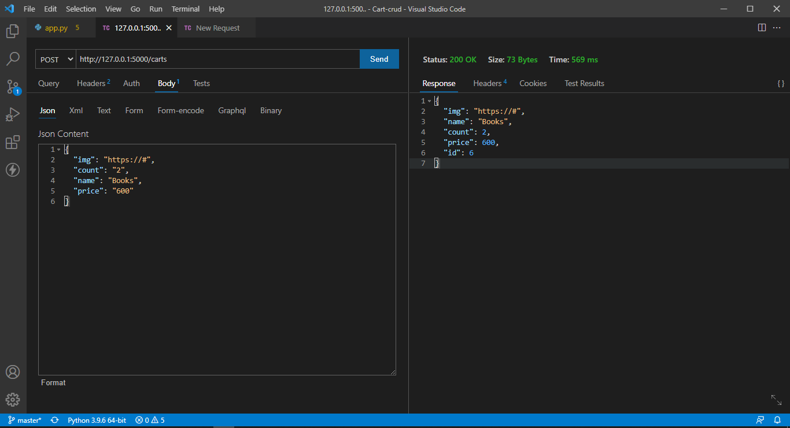
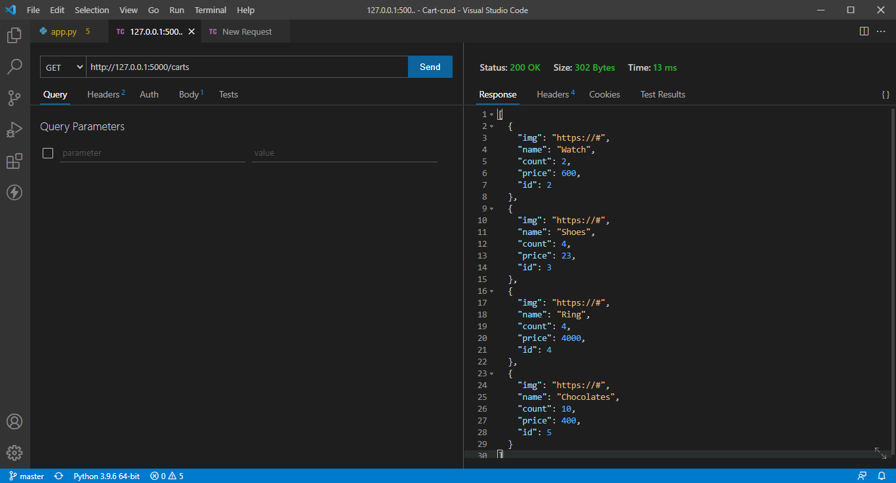
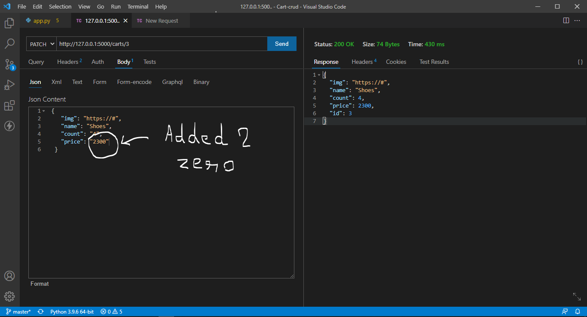
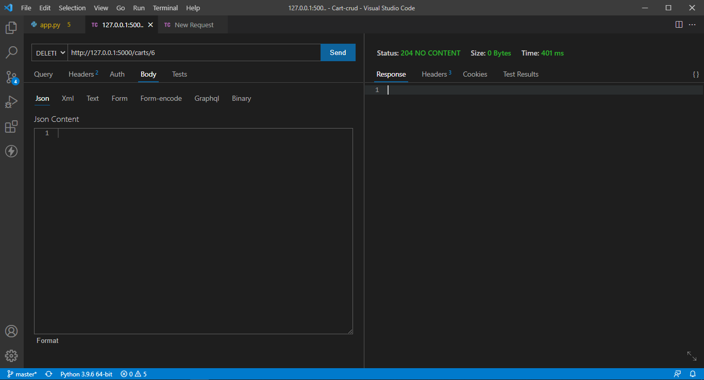
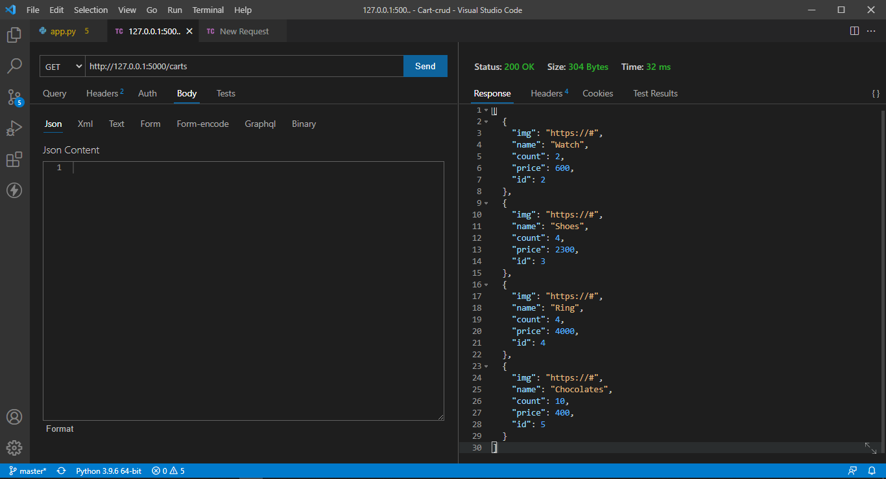

# Cart-API

Here, using this API, we can perform CRUD operation - **Create, Read, Update and Delete**  
 

## Create

On sending *POST* request with json data in body section to the endpoint "cart", the API will add this data to database. The below image demonstartes the same:  

   

## Read

On sending *GET* request to the endpoint "cart", the API will fetch all data from database and will dump them. The below image demonstartes the same:  

   

## Update

On sending *PATCH* request to the endpoint "cart/<'id'>" where *id* is the id of the product, the API will update the data of product with that perticular id and will dump it as a response. The below image demonstartes the same:  

We can rectify this by 2nd image where the data with *"id:3"* has *"price:23"*, but after correction, its price has changed to *"price:2300"*

   

## Delete

On sending *DELETE* request to the endpoint "cart/<'id'>" where *id* is the id of the product, the API will **DELETE** the data of product with that perticular id from the cart. The below image demonstartes the same:  

   

List of cart element after Deletion of the product with given ID:    

   
